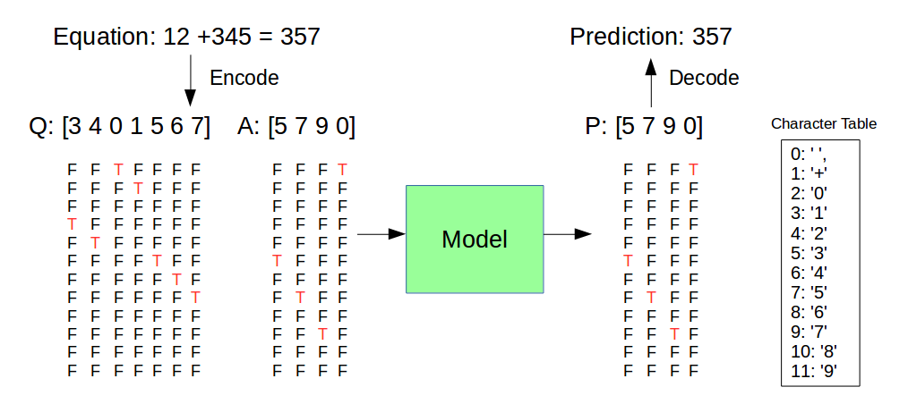

# DL-Adder-Subtractor

## Notes for TAs

For Coding part, please refer to Demo.ipynb in this repo

For Analyze part, please refer to Report.md in this repo

## Introduction

使用深度學習的技術（主要爲 Recurrent Neural Network），讓電腦學習：

1. 加法 （3~5位數）
2. 減法（3~5位數）
3. 加法與減法合並（3~5 位數）

## Flow

## Model

Encoder 的部分，可以看成先將待求的算式理解並且歸納成爲一個向量（128維度）

Decoder 的部分，則是通過 Encoder 的向量輸出，通過 LSTM 之後，輸出128 維度向量，經過 12 個 neurons 後再通過 soft-max 預測該位置的數字

（注：以 1 層 LSTM Decoder，Output 4 位數爲例）

