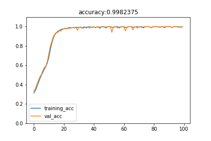

# Deep Learning Adder & Subtractor

## Introduction

使用深度學習的技術（主要爲 Recurrent Neural Network），讓電腦學習：

1. 加法 （3~5位數）
2. 減法（3~5位數）
3. 加法與減法合並（3~5 位數）

這一篇報告討論不同參數下模型訓練的過程及表現

調整以下參數：

* 模型選擇
* 訓練集大小
* 模型層數
* 加減法位數
* 訓練 Epoch
* Encoder Hidden Size

## Flow

## Model

因爲計算加法、減法，在直覺上，與數字前後位置有關聯，所以選用 Recurrent Neural Network 的架構

這裏使用[這篇論文](https://arxiv.org/abs/1409.0473)提到的 Encoder 和 Decoder 的概念搭建模型

Encoder 的部分，可以看成先將待求的算式理解並且歸納成爲一個向量（128維度）

Decoder 的部分，則是通過 Encoder 的向量輸出，通過 LSTM 之後，輸出128 維度向量，經過 12 個 neurons 後再通過 soft-max 預測該位置的數字

（注：以 1 層 LSTM Decoder，Output 4 位數爲例）

#### LSTM vs GRU

  

通常情況下，GRU 參數少，更容易收斂，但在 3 layers 的情況下，反而 LSTM 的表現比較穩定，並且更早收斂，所以最後選用 LSTM

### 1. Adder

模型設定：

* Input 爲 Digit 個數 × 2 + 1 （要有一個 ‘+’ 的符號）
* Output 爲 Digit 個數 + 1 （有可能進位）

#### 1.1 訓練集大小對 Model 的影響

參數：

* Decoder: 1 層 LSTM
* Epoch: 100
* Digits: 3
* 訓練集大小:（左上：20000， 右上：40000，左下：60000）

   
     

分析：

* 訓練集越大，Model 在越早的 Epoch 收斂
* 訓練集越大，Model 準確度越高
* 訓練集越大，Model 的 Validation Loss 波動越小

果然還是印證 Deep learning 的一句老話：

> ## Get More Data !!

#### 1.2 3~5位數加法比較

參數：

- Decoder: 1 層 LSTM
- Epoch: 100
- 訓練集大小：20000
- Digits: （左上：3， 右上：4，左下：5）

    

（注：圖片上方 Accuracy 爲 Test Accuracy，以下皆同）

分析：

* digit 數量越多越難收斂，這符合直覺，數字個數越多 Model 所要學習的內容也就越多（數字每多一位，Output就多兩位）

再**加大訓練集**看看結果如何！

* 訓練集大小：40000

* Digits: （左：4，右：5）

   

分析：

* 確實相比之前有多一點進步

看來有一點起色！**More Data！**

- 訓練集大小：60000

- Digits: （左：4，右：5）

   

分析：

* 4 Digits 的 Model 已經到達 98% 的正確率
* 5 Digits 的 Model 還需要進一步優化

#### 1.3 層數對 Model 的影響

除了增加訓練 Data 之外，增加層數也可以提高 Model fit data 的能力

試着增加一層 LSTM 來提高 5 Digits 的 Model 準確度

參數：

- Epoch: 100
- 訓練集大小：60000
- Digits: 5
- Decoder: （左：１層，右：2 層）

   

分析：

* 增加一層 LSTM 後對於 Model 的 Fitting 能力有所提高，Validation Accuracy 也提高，Test Accuracy 也達到 98% 了！

#### 1.4 數據集大小與 Epoch 的關系

如果數據集不夠大，卻訓練更多 Epoch 的話， Model 很可能會發生 Over Fitting 的現象

參數：

- 訓練集大小：20000
- Digits: 5
- Decoder: 1層
- Epoch: （左：100，右：200）

   

分析：

* 右邊訓練 200 個 Epoch 的模型已經進入了 Over Fitting 的狀態，Training Accuracy 幾乎達到 100% 但是 Validation Accuracy 卻往下降，這是明顯的 Over Fitting 的指標

### 2. Subtractor

這裏的 Subtractor 訓練的是 A - B 且 A >= B 的情況，也就是不會出現負數 

模型設定：

- Input 爲 Digit 個數 × 2 + 1 （要有一個 ‘-‘ 的符號）
- Output 爲 Digit 個數（和加法不同，減法不會有進位）

#### 2.1 訓練集大小對 Model 的影響

參數：

- Decoder: 1 層 LSTM
- Epoch: 100
- Digits: 3
- 訓練集大小:（左上：20000， 右上：40000，左下：60000）

    

分析：

* 基本上與 Adder 的分析相同
* 有趣的是 Subtractor 雖然 Output 少了一個位數，但比 Adder 更難訓練 （左：Subtractor，右：Adder，參數相同）

   

#### 2.2 3~5位數減法比較

參數：

- Decoder: 1 層 LSTM
- Epoch: 100
- 訓練集大小：60000
- Digits: （左上：3， 右上：4，左下：5）

    

分析：

* 基本上與 Adder 相同，Digit 越多， Model 越難收斂

### 3. Adder Subtractor Combined

模型設定：

- Input 爲 Digit 個數 × 2 + 1 （要有一個 ‘+’ 或者 ’-‘ 的符號）
- Output 爲 Digit 個數 + 1 （有可能進位）

Training Data 中刻意設計一半爲加法，一半爲減法

#### 3.1 訓練集大小對 Model 的影響

參數：

- Decoder: 1 層 LSTM
- Epoch: 100
- Digits: 3
- 訓練集大小:（左上：20000， 右上：40000，左下：60000）

    

分析：

* 基本上與 Adder 的分析相同
* Combined 比 Adder 和 Subtractor 都更難訓練（左上：Combined，右上：Adder，左下：Subtractor）

    

#### 3.2 3~5位數加法減法比較

參數：

- Decoder: 1 層 LSTM
- Epoch: 100
- 訓練集大小：60000
- Digits: （左上：3， 右上：4，左下：5）

    

分析：

- 基本上與 Adder 相同，Digit 越多， Model 越難收斂

#### 3.3 層數與 Model 的關系

和 Adder 一樣，通過增加層數，可以將 Model 的準確率提高

參數：

- Epoch: 100
- 訓練集大小：60000
- Digits: 5
- Decoder: （左：１層，右：2 層）

   

#### 3.4 增加 Encoder Hidden Size

因爲 5 位數的 Data 比較復雜，嘗試增加 Encoder 的 Hidden Size 來獲取更多的資訊

參數：

- Epoch: 100
- 訓練集大小：100000
- Digits: 5
- Encoder Hidden Size: 256
- Decoder: 2 層

 

（準確率爲 0.9697）

分析：

* 可以觀察到比上一個 Model 表現好很多
* 即使 Train 了 150 個 Epoch，準確率無法繼續往上升

## Conclusion

1. 數據集的大小對 Model 的表現有重大的影響
2. 在面對更復雜的 Data 時增加 Layer 的數量可以有效的提高 Accuracy
3. 盲目的訓練過多的 Epoch 會造成 Over Fitting
4. 增加 Encoder 的 Hidden Size 可以提高復雜模型的準確率

### How about multiplication ?

可以看到我們的 Model 在做五位數的加法時，Model 已經很難 Fit 了

主要是因為結果需要 Predict 的位數 range 太大，模型很難 fit

對於乘法來說，3 * 3 的乘法很容易就到 6 位數，Model 是很難去學習的

如果使用同樣的方法去訓練乘法的模型無法收斂
